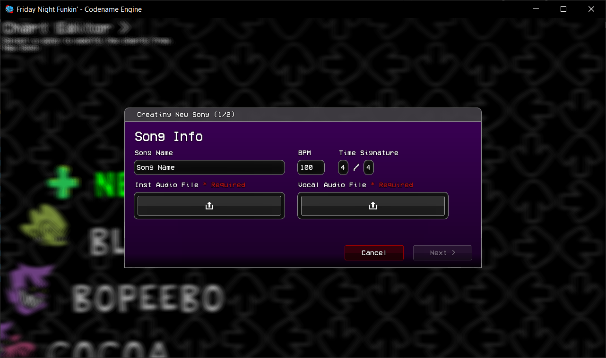
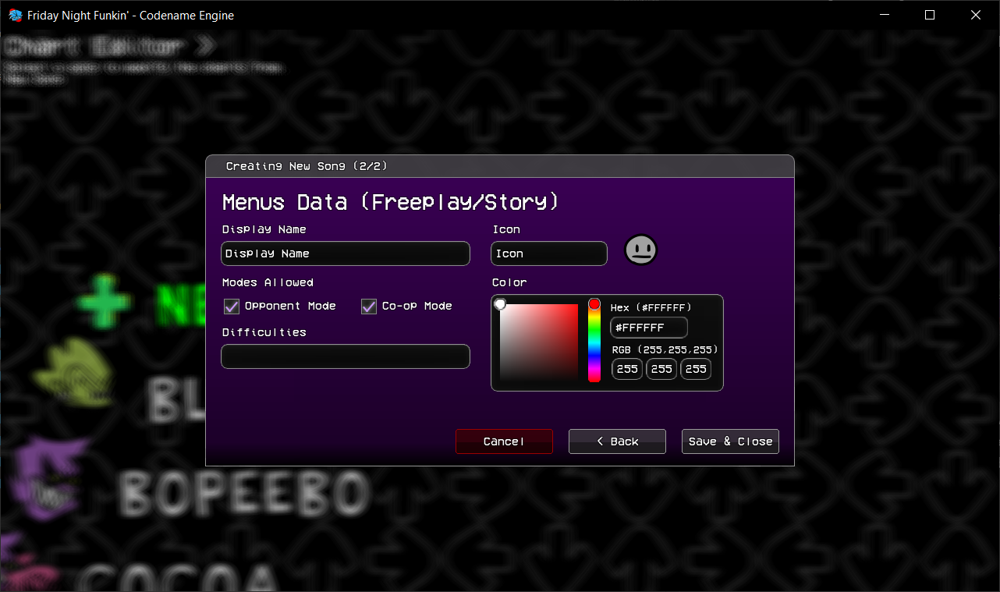
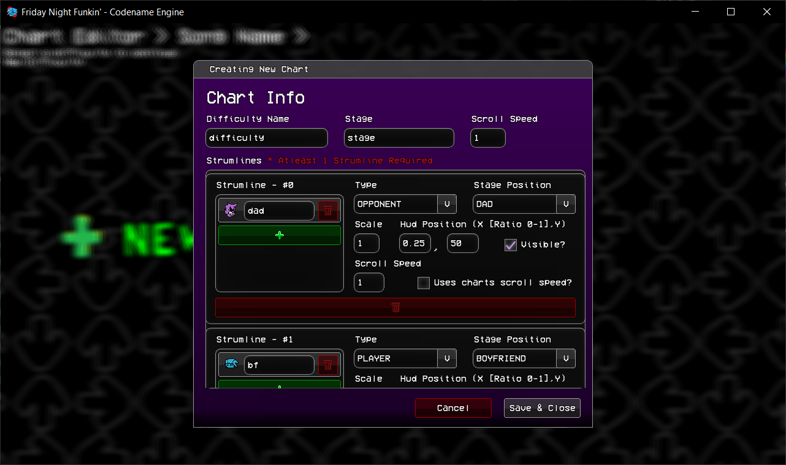
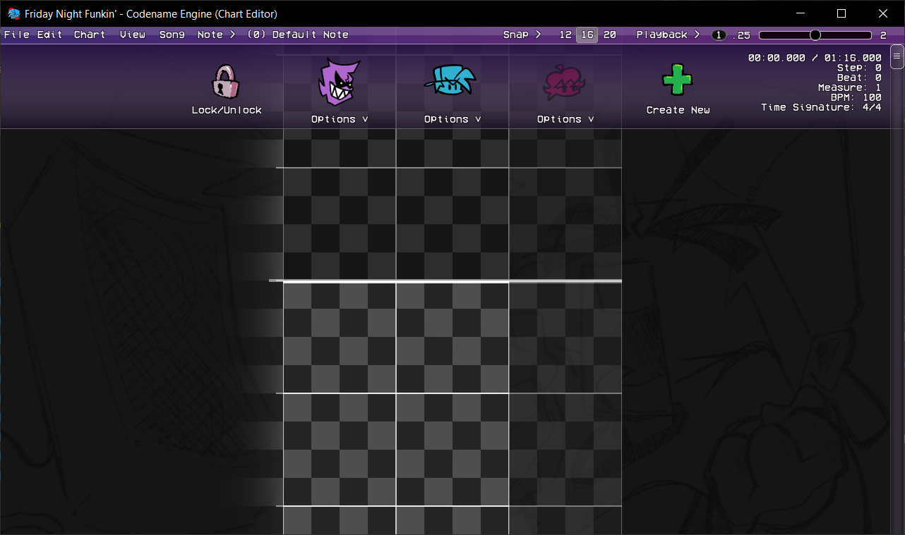
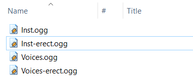

# Creating Songs.

Creating songs is very simple, there's currently 2 ways of making them, and we will be focusing on the in-engine way for now.

### Creating the song itself.

Creating a song using the New Song option when entering Chart Editor selection will bring up this menu. This is self-explanatory, just put the song name there, the bpm, time signature, the audio files and you're done here.
(Vocals are optional here but we forgot to fix a bug haha)

Proceeding to the next page after inputting our audio files, we arrive at this. This is where we input our meta data, though also self-explanatory and not much to explain.  
Pressing Save & Close and Congratulations your song has been made!

### Creating difficulties for the song.

Although we have made our song, it's still missing the charts. This is where creating difficulties take place.

Upon selecting New Difficulty, after selecting on our newly created song, brings us to this window. Now this looks overwhelming at first, but keep in mind you only have to focus on the top part the most.   Looking at the top part we can change the difficulty name, the stage and the scroll speed. Once you're done filling those you can proceed with pressing Save & Close, and your difficulty will be created.   <i>(If you're curious about the bottom part, see <a href="Chart Editor Features.md">Chart Editor Features</a>)</i>

### Opening the chart editor.

Opening the chart editor is done by selecting one of the song's difficulties displayed. After that, you'll be presented with the Chart Editor. After doing the charting work, you can proceed to saving the chart.

As you can see, there's a lot of options on how to save the chart, but for now only focus on the first 2 save options. Of course, you get to save without having to deal with a file dialogue, as the engine will automatically save the chart on the correct charts folder.   While saving normally is highly recommended, we also offer the option to save separately.

Now that you've learned to make and chart a song, you can proceed to <a href="Chart Editor Features.md">Chart Editor Features</a>, to learn about advanced features.

### ADDITIONAL. Different audio per difficulty.

If you ever wanted to make an erect-esque difficulty, the engine allows for that without scripting it in.   Simply add the alternative audio files and rename it to have a ``-difficulty`` at the end. (``Voices-difficulty.ogg`` and ``Inst-difficulty.ogg``).

